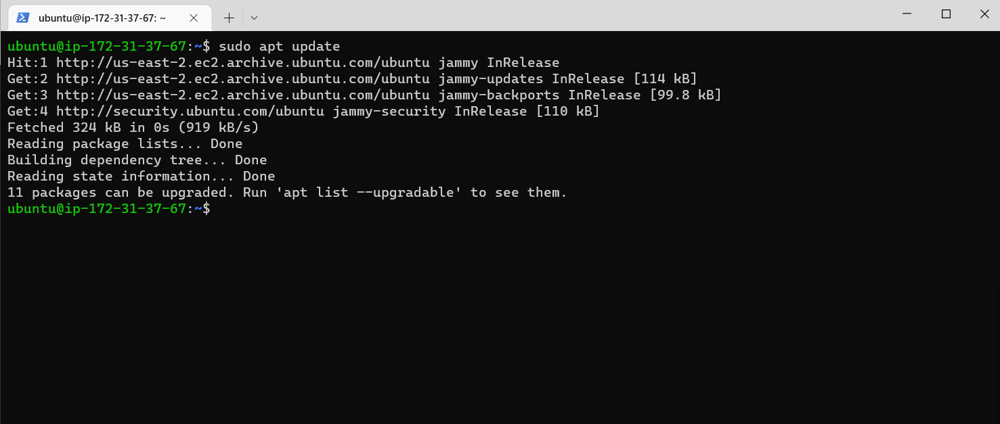
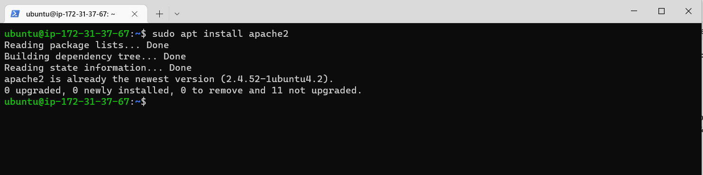
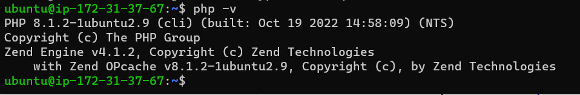

 Project-1
# Setting up Apache Web Server

What exactly is Apache?

Apache HTTP Server is the most widely used web server software. Developed and maintained by Apache Software Foundation, Apache is an open source software available for free. It runs on 67% of all webservers in the world. It is fast, reliable, and secure. It can be highly customized to meet the needs of many different environments by using extensions and modules. Most WordPress hosting providers use Apache as their web server software. However, websites and other applications can run on other web server software as well. Such as Nginx, Microsoft’s IIS, etc.

To deploy the web application, we first need to install apache via ubuntu package manager apt

Updating Packages
$ sudo apt update 

$ sudo apt install apache2

starting apache2 Server
$ systemctl start apache2

checking that apache2 starts automatically on system boot
$ systemctl enable apache2

checking server 
$ systemctl status apache2

To check how we can access it locally in our Ubuntu shell, i then run:

 curl http://127.0.0.1:80

# INSTALLING MYSQL

We use MySQL as a relational database to store and manage data on our site.

Install mysql using the sudo apt install mysql command

Use the sudo mysql_secure_installation command to remove insecure default settings and enable protection for the database

On successful secure configuration, sudo mysql on the terminal to have access to the MySQL DB.

Exit from the MySQL terminal by typing exit

# Installing PHP and its Modules

PHP serves as a programming language which is useful for dynamically displaying contents of the webpage to users who make requests to the webserver.

We need to install php alongside its modules, php-mysql which is php module that allows php to communicate with the mysql database, libapache2-mod-php which ensures that the apache web server handles the php contents properly.

sudo apt install php php-mysql libapache2-mod-php

 we can check the version to see if it was properly installed

 
# Creating Web Domain For Our Site

Apache webserver serves a website by the way of server blocks inside its /var/www/ directory, and it can support multiple of this server blocks to host other websites.

