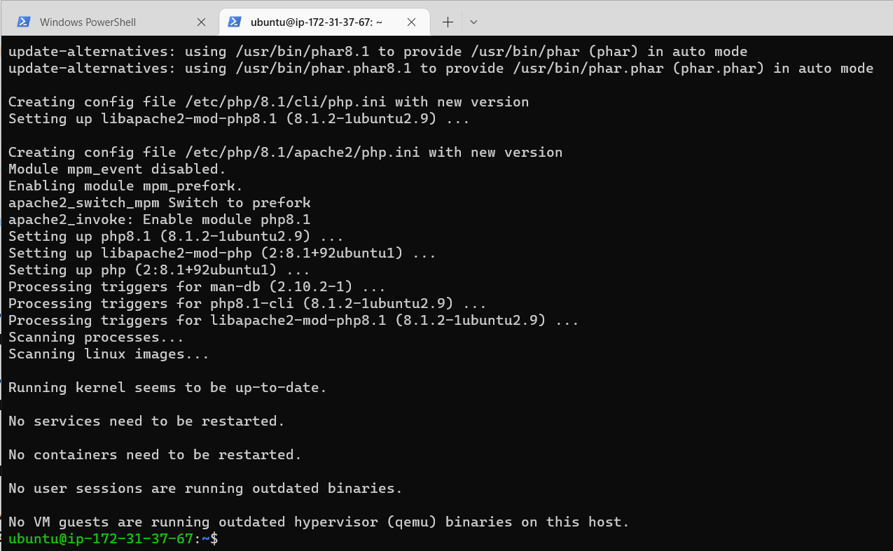
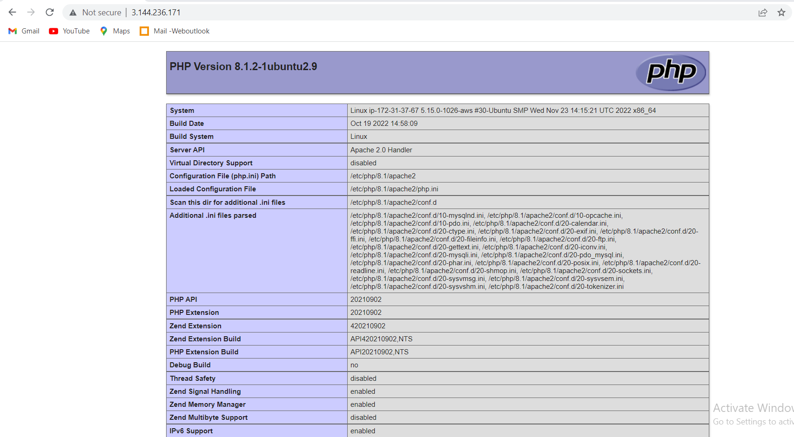

 Project-1
# Setting up Apache Web Server

What exactly is Apache?

Apache HTTP Server is the most widely used web server software. Developed and maintained by Apache Software Foundation, Apache is an open source software available for free. It runs on 67% of all webservers in the world. It is fast, reliable, and secure. It can be highly customized to meet the needs of many different environments by using extensions and modules. Most WordPress hosting providers use Apache as their web server software. However, websites and other applications can run on other web server software as well. Such as Nginx, Microsoft’s IIS, etc.

To deploy the web application, we first need to install apache via ubuntu package manager apt

Updating Packages
$ sudo apt update 

$ sudo apt install apache2

starting apache2 Server
$ systemctl start apache2

checking that apache2 starts automatically on system boot
$ systemctl enable apache2

checking server 
$ systemctl status apache2

To check how we can access it locally in our Ubuntu shell, i then run:

 curl http://127.0.0.1:80

# INSTALLING MYSQL

We use MySQL as a relational database to store and manage data on our site.

Install mysql using the sudo apt install mysql command

Use the sudo mysql_secure_installation command to remove insecure default settings and enable protection for the database

On successful secure configuration, sudo mysql on the terminal to have access to the MySQL DB.

Exit from the MySQL terminal by typing exit

# Installing PHP and its Modules

PHP serves as a programming language which is useful for dynamically displaying contents of the webpage to users who make requests to the webserver.

We need to install php alongside its modules, php-mysql which is php module that allows php to communicate with the mysql database, libapache2-mod-php which ensures that the apache web server handles the php contents properly.

sudo apt install php php-mysql libapache2-mod-php

 we can check the version to see if it was properly installed

 
# Creating Web Domain For Our Site

The projectlampstack directory represents the directory which will contains files related to our website as it represents a new server block on the apache webserver. In order to spin up this server block we need to configure it by creating a .conf file.

sudo vi /etc/apache2/sites-available/projectlampstack.conf

The below represents the configuration needed to spin up the server block.

Run esc :wq  to save and terminate vi editor.

Run sudo a2ensite projectlampstack to activate the server block.

Run sudo a2dissite 000-default to deactivate the default webserver block that comes with apache on default.

Reload the apache2 server sudo systemctl reload apache2

# Enable php on the wesite

This is useful for setting up maintenance pages in PHP applications, by creating a temporary index.html file containing an informative message to visitors, To serve an index.php containing the server-side code, you’ll need to edit the /etc/apache2/mods-enabled/dir.conf file and change the order in which the index.php file is listed within the DirectoryIndex. I will now run

sudo vim /etc/apache2/mods-enabled/dir.conf

Run the sudo systemctl reload apache2 to restart the apache2 web server for the changes made to the DirectoryIndex to take effect.

Create an index.php file in our webserver block and add the following code using the vim editor

Input the instance public ip address on a web browser

